# css_demos


#### 介绍

##### 分享项目过程中遇见的有趣的 css 样式+一些基本 css 样式问题+css3 动画+canvas+svg，原生 js+Jquery+Vue+threejs 等，持续更新，相互学习，并非所有案例皆原创，非原创作品会标出，如果对你有帮助，欢迎你的 star+订阅！

#### 安装

##### 1.克隆或下载压缩包

```
git clone https://gitee.com/susuhhhhhh/css_demos.git
```

##### 2.将 web 文件夹导入开发工具

#### 数据可视化之 echarts~

- [x] 1、柱状图多数据-dataZoom 滑动缩放
- [x] 2、动态关系图-缩放-拖拽

#### 神奇的 CSS~

- [x] 1.  细说 css 的 conic-gradient+linear-gradient+radial-gradient，重点在于圆锥渐变，很神奇的一个属性，不过兼容性有点差哈~
- [x] 2.  设置不同的 border，结合伪元素，得到三角形，梯形，空心箭等样式，本案例列举很多，一次性搞懂叭~
- [x] 3.  鼠标的移出与移入事件，onmouseover+onmouserout
- [x] 4.  原生实现图片上传+jq 实现+vue 实现
- [x] 5.  echarts-wordcloud 实现词云图
- [x] 6.  css 的 filter 属性（滤镜）
- [x] 7.  一些动感的加载动画
- [x] 8.  css 实现彩虹 loading
- [x] 9.  原生 js 实现上拉加载+下拉刷新
- [x] 10. 头部渐变色，鼠标悬浮变色
- [x] 11. box-shadow+radial-gradient+border-image+box-reflect 四种方法实现矩形四个角圆点
- [x] 12. 原生 js 实现图片上一张下一张点击
- [x] 13. 一个简单的小动画
- [x] 14. 一个简单单的渐变动画画画画
- [x] 15. 一些卡券样式
- [x] 16. 一个 mix-blend-mode 的小动画
- [x] 17. 新增一些 loading 动画
- [x] 18. 一个可爱的蛋黄样式的 switch 按钮（学习案例）
- [x] 19. 原生 js+three.js 等实现一个 3d 元素周期表（学习案例，尊重原创）
- [x] 20. 一个切换的小按钮
- [x] 21. 翻转 360 度的艺术字
- [x] 22. 正在输入的文字动画
- [x] 23. 一个有趣的 404 页面
- [x] 24. 仿 gitee 动态的步骤条
- [x] 25. 实现一个带圆弧的气泡（类似 QQ 气泡）
- [x] 26. 自定义滚动条样式
- [x] 27. 一个渐变色的字体
- [x] 28. 一个 hover 加载边框的按钮
- [x] 29. 一个炫酷的按钮
- [x] 30. 一个 hover 按钮
- [x] 31. clip-path 实现一个带有水波纹路文字
- [x] 32. background-clip:text 实现一个文字
- [x] 32. 步骤条
- [x] 33. 鼠标自定义样式
- [x] 34. 一个弹出框动画
- [x] 35. 新增一个垂直步骤条
- [x] 36. 新增一个 404 页面
- [x] 37. 自定义验证码输入框+倒计时
- [x] 38. 新增一个 loading 动画
- [x] 39. 一个拟物态 switch 按钮
- [x] 40. 新增一个粒子背景（canvas+原生 js）
- [x] 41. 按钮+1
- [x] 42. 一个旋转的 3d 矩形
- [x] 43. 新增一个步骤条
- [x] 44. 一个地址选择组件
- [x] 45. 文字超出宽度省略号的 4 种方式
- [x] 46. 原生 js 实现时钟特效
- [x] 47. 按钮+1
- [x] 48. 动画+1
- [x] 49. 一些悬浮特效按钮
- [x] 50.clip-path 实现线框
- [x] 51. dom 元素的动态添加与删除（jq）
- [x] 52. 一些按钮们
- [x] 53. loading 水球
- [x] 54. loading 动画新增
- [x] 55. 一个粘性小球
- [x] 56. 卡券样式++
- [x] 57. 按钮+1
- [x] 58. flex 竖向布局父元素固定高度超出滚动导致的高度塌陷问题（flex-shrink: 0;）
- [x] 59. canvas 背景特效
- [x] 60. 按钮+1
- [x] 61. 地球转动动画
- [x] 62. 烟花随鼠标移动
- [x] 63. 火焰按钮
- [x] 64. css 实现文字打印
- [x] 65. 文字雨
- [x] 66. 带弧度的 tab 选项卡
- [x] 67. css 实现带圆角的圆弧进度条（非 svg，非 echarts，非 canvas）
- [x] 68. 悬浮菜单
- [x] 69. 灯泡光影
- [x] 70. 不定长卡券背景
- [x] 71. 数字雨
- [x] 72. 边框圆角渐变色
- [x] 73. 扫一扫的样式
- [x] 74. css 实现各类奇形怪状按钮
- [x] 75. 谷歌 tab 标签栏实现的多种方法
- [x] 76. 箭头按钮
- [x] 77. css3 动画实现文字跳动
- [x] 78. box-shadow 悬浮卡片效果
- [x] 79. 文字折叠效果
- [x] 80. h5 实现头部背景渐变色+弧度
- [x] 81. 文字填充效果
- [x] 82. 毛玻璃效果
- [x] 83. 新增 loading 动画
- [x] 84. CSS 实现手机充电效果
- [x] 85. 跳动的方块
- [x] 86. 页面的滚动产生的小猫咪条
- [x] 87. gitee 的 GVP 文字动画效果（gif 实现）
- [x] 88. 2022 文字动画
- [x] 89. 震碎的文字
- [x] 90. 一个按钮
- [x] 91. svg 实现一个六角线框
- [x] 92. 一个鼠标悬浮产生的动画
- [x] 93. 一个博客首页小 demo
- [x] 94. 动画实现波浪效果
- [x] 95. svg 实现按钮 hover 效果
- [x] 96. 光影变化文字效果
- [x] 97. canvas 实现烟花特效
- [x] 98. css 实现冰墩墩
- [x] 99. 纯 css 实现一个雪容融
- [x] 100. canavas 实现雨点特效
- [x] 101. CSS @property 属性用法
- [x] 102. drop-shadow 和 box-shadow 的区别
- [x] 103. clip-path+drop-shadow+conic-gradient+@Property 实现一个炫酷的三角形
- [x] 104. cdn 引入 vue，实现一个简易的数据看板
- [x] 105. cdn 引入 axios，实现一个简易的数据表格
- [x] 106. 芒果 TV-loading 动画
- [x] 107. 滚动的数字
- [x] 108. clip-path 实现圆弧进度条
- [x] 109. svg 实现圆弧进度条
- [x] 110. 数字滚动
- [x] 111. 滑动幻灯片 0001（jq 插件，来自 jq 之家）
- [x] 112. 数据看板，数据高亮选择
- [x] 113. box-shadow 实现的圆弧 loading 动画
- [x] 114. css 实现悬浮图片产生遮罩变形
- [x] 115. canvas 实现时钟
- [x] 116. SVG 波浪
- [x] 117. css 动画 step（）实现文字打印效果
- [x] 118. checkbox 选中切换效果
- [x] 119. 页面效果——鼠标 hover 放大图片
- [x] 120. 页面效果——鼠标 hover 缩小图片，展示功能区
- [x] 121. 底部渐变色阴影展开与收起
- [x] 122. 三个半圆弧绕圈动画
- [x] 123. 多圆环绕圈动画
- [x] 124. 倒计时动画
- [x] 125. 圆环绕圈-月牙
- [x] 126. input-focus 宽度过渡动画
- [x] 127. 椭圆圆点绕圈动画
- [x] 128. 椭圆围绕球体转动
- [x] 129. loading 动画 01
- [x] 130. loading 动画 02
- [x] 131. loading 动画 03
- [x] 132. tabbar 凹凸选中动画
- [x] 133. hover 纸张折角效果
- [x] 134. 弹框抽屉过渡动画
- [x] 135. 圆形菜单弹出动画
- [x] 136. border-radius 变形
- [x] 137. 音频 loading 动画
- [x] 138. lottie 动画的实现（JSON 数据来自阿里巴巴矢量图标库）
- [x] 139. clip-path 实现圆点围绕半圆弧转一圈,无圆弧处圆点消失，保持旋转 1turn
- [x] 140. 百分比环形
- [x] 141. 温度计图表
- [x] 142. loading 动画+1
- [x] 143. gsap 数字滚动
- [x] 144. 菱形进度条
- [x] 145. css3 动画+svg 波浪实现水球进度条
- [x] 146. css 动画+translate 实现流星划过
- [x] 147. css 实现 3d 楼梯旋转动画
- [x] 148. Grid 布局实现九宫格图片动画
- [x] 149. CSS 实现卡片边框渐变动画
- [x] 150. CSS 实现 3d 魔方
- [x] 151.SVG 实现拟物态圆环进度条
- [x] 152.SVG-stroke-dasharray 分割
- [x] 153.七彩圆环 loading
- [x] 154.CSS 实现灯笼动画
- [x] 155.CSS 实现六角灯笼-兔年大吉

#### 数据可视化之 echarts 部分截图~

##### 动态关系图-缩放-拖拽


##### 柱状图多数据-dataZoom 滑动缩放

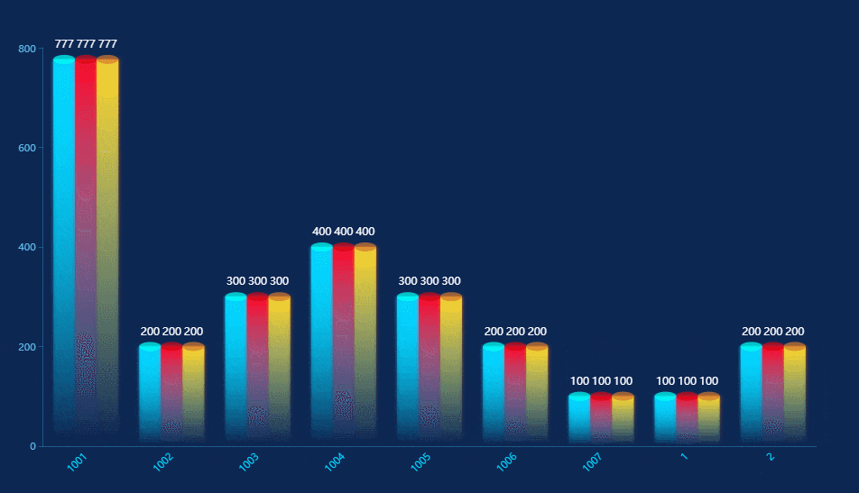

#### 神奇的 CSS 页面部分截图

##### 155.CSS 实现六角灯笼-兔年大吉


##### 154.CSS 实现灯笼动画


##### 153.七彩圆环 loading


##### 152.SVG-stroke-dasharray 分割


##### 151.SVG 实现拟物态圆环进度条


##### 150. CSS 实现 3d 魔方


##### 149. CSS 实现卡片边框渐变动画

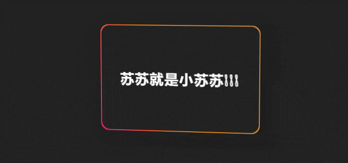

##### 148. Grid 布局实现九宫格图片动画


##### 147.css 实现 3d 楼梯旋转动画


##### 146.css 动画+translate 实现流星划过

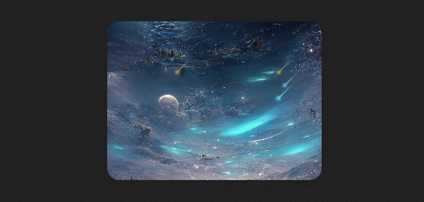

##### 145. css3 动画+svg 波浪实现水球进度条

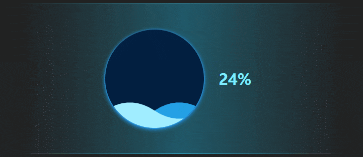

##### 144. 菱形进度条

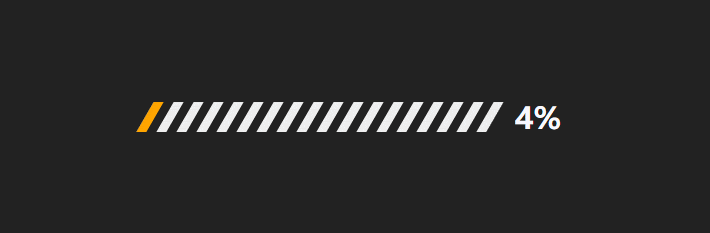

##### 143. gsap 数字滚动


##### 142.loading 动画+1

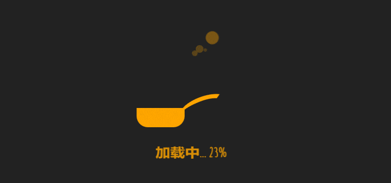

##### 141. 温度计图表

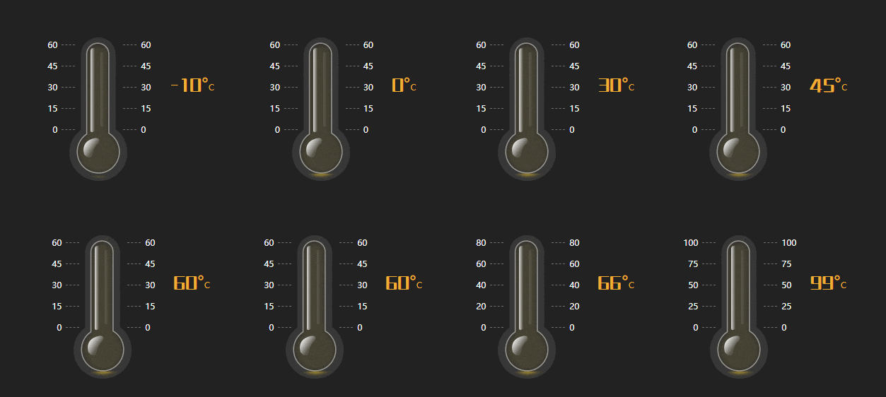

##### 140. 百分比环形


##### clip-path 实现圆点围绕半圆弧转一圈,无圆弧处圆点消失，保持旋转 1turn

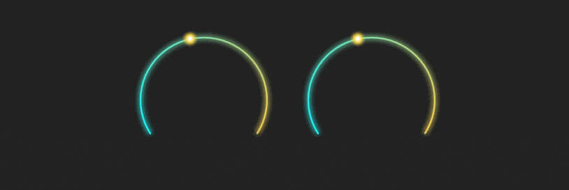

##### lottie 动画的实现（JSON 数据来自阿里巴巴矢量图标库）

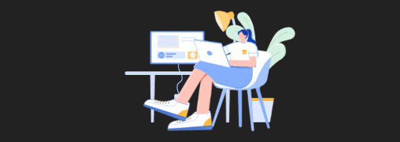

##### 音频 loading 动画


##### border-radius 变形

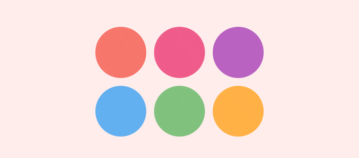

##### 圆形菜单弹出动画


##### 弹框抽屉过渡动画

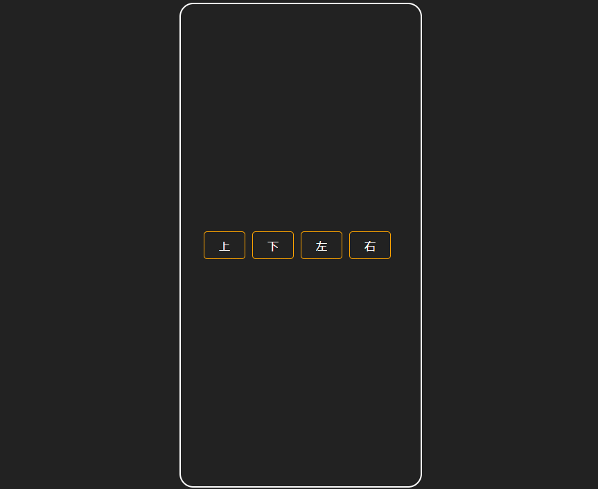

##### hover 纸张折角效果

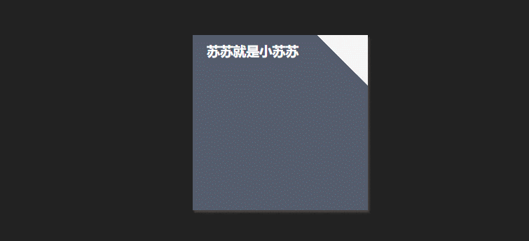

##### tabbar 凹凸选中动画

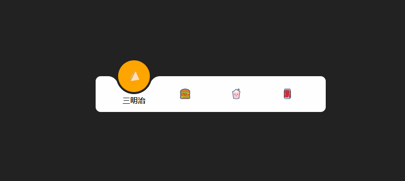

##### loading 动画 03


##### loading 动画 02


##### loading 动画 01

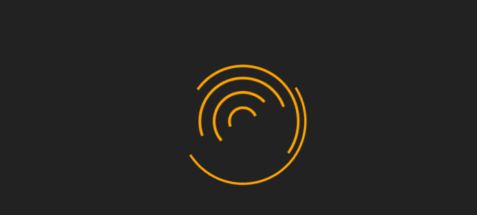

##### 椭圆围绕球体转动

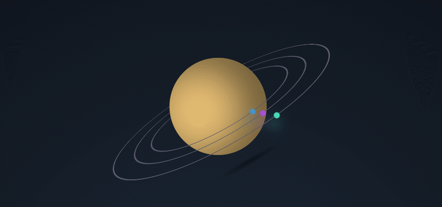

##### 椭圆圆点绕圈动画

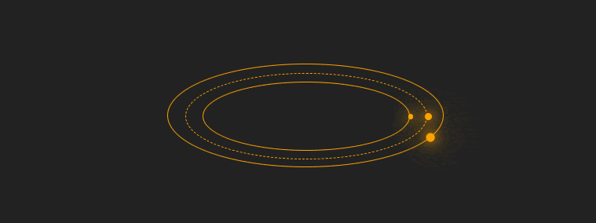

##### input-focus 宽度过渡动画

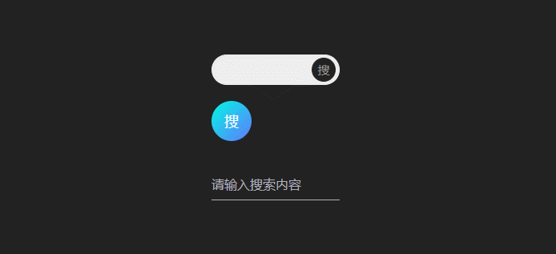

##### 圆环绕圈-月牙

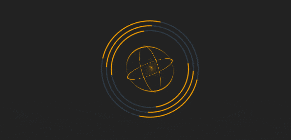

##### 倒计时动画


##### 多圆环绕圈动画

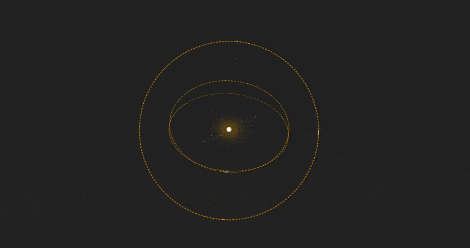

##### 三个半圆弧绕圈动画

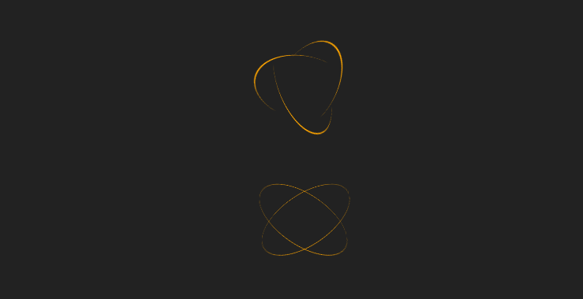

##### 底部渐变色阴影展开与收起


##### 页面效果——鼠标 hover 缩小图片，展示功能区

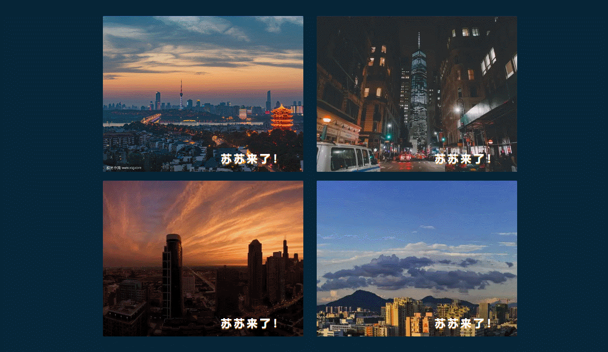

##### 页面效果——鼠标 hover 放大图片


##### checkbox 选中切换效果

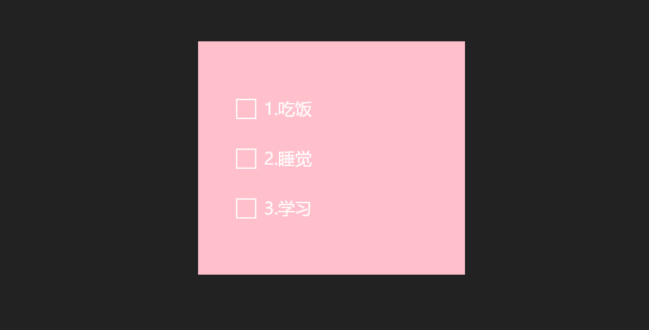

##### css 动画 step（）实现文字打印效果

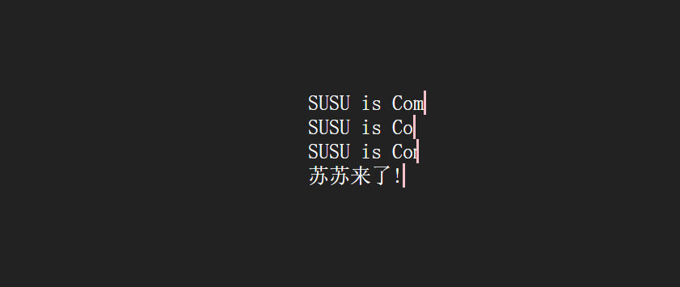

##### SVG 波浪


##### canvas 实现时钟


##### css 实现悬浮图片产生遮罩变形


##### box-shadow 实现的圆弧 loading 动画


##### 数据看板，数据高亮选择


##### 滑动幻灯片 0001


##### 数字滚动


##### svg 实现圆弧进度条


##### clip-path 实现圆弧进度条


##### 滚动的数字


##### 芒果 TV-loading 动画


##### 简易的数据表格


##### 数据看板


##### clip-path+drop-shadow+conic-gradient+@Property 实现一个炫酷的三角形


##### drop-shadow 和 box-shadow 的区别


##### CSS @property 属性用法


##### 雨点特效


##### 纯 css 实现一个雪容融


##### css 实现冰墩墩


##### canvas 实现烟花特效


##### 光影变化文字效果


##### svg 实现按钮 hover 效果


##### 动画实现波浪效果


##### 一个博客首页小 demo


##### 一个鼠标悬浮产生的动画


##### svg 实现一个六角线框


##### 一个按钮


##### 震碎的文字


##### 2022 文字动画


##### GVP 文字动画效果（gif 实现）


##### 页面的滚动产生的小猫咪条


##### 跳动的方块


##### CSS 实现手机充电效果


##### 新增 loading 动画


##### 毛玻璃效果


##### 文字填充效果


##### h5 实现头部背景渐变色+弧度


##### 文字折叠效果


##### box-shadow 悬浮卡片效果


##### 动画实现文字跳动


##### 箭头按钮


##### 谷歌 tab 标签栏


##### 各类奇形怪状按钮


##### 扫一扫的样式


##### 边框圆角渐变色


##### 数字雨


##### 不定长卡券


##### 灯泡光影


##### 悬浮菜单


##### css 实现带圆角的圆弧进度条


##### 带弧度的 tab 选项卡


##### 文字雨


##### css 实现文字打印


##### 火焰按钮


##### 烟花随鼠标移动


##### 地球转动动画


##### 按钮+1


##### canvas 背景特效


##### flex 竖向布局父元素固定高度超出滚动导致的高度塌陷问题（flex-shrink: 0;）


##### codepen 按钮


##### 卡券样式++


##### 一个粘性小球


##### loading 动画新增


##### loading 水球


##### 按钮们


##### dom 元素的动态添加与删除（jq）


##### clip-path 实现线框


##### 悬浮特效按钮


##### loading 动画


##### 按钮


##### 时钟特效


##### 文字超出宽度省略号的 4 种方式


##### 地址选择


##### 步骤条


##### 旋转的 3d 矩形


##### 按钮+1


##### 粒子背景（canvas+原生 js）


##### 拟物态 switch 按钮


##### loading 动画+1


##### 自定义验证码输入框+倒计时


##### 404 页面


##### 垂直步骤条


##### 弹出框动画


##### 鼠标自定义


##### 步骤条


##### background-clip:text 实现一个文字


##### 有水波纹路文字


##### hover 按钮


##### 炫酷的按钮


##### 加载边框的按钮


##### 渐变色的字体


##### 自定义滚动条样式


##### 个带圆弧的气泡（类似 QQ 气泡）


##### gitee 动态的步骤条


##### 有趣的 404 页面


##### 文字动画


##### 翻转 360 度的艺术字


##### 切换的小按钮


##### 3d 元素周期表


##### 可爱的蛋黄样式的 switch


##### 新增 loading 动画


##### mix-blend-mode 的小动画


##### 卡券样式


##### 简单单的渐变


##### 简单的小动画


##### 原生 js 实现图片上一张下一张点击


##### 矩形四个角圆点


##### 头部渐变色


##### 上拉加载+下拉刷新


##### 彩虹 loading：


##### 加载动画：


##### 词云图


##### 上传图片


##### 鼠标的移出与移入事件


##### 三角形实现：


##### 圆锥渐变：

1.  设置不同的 border，结合伪元素，得到三角形，梯形，空心箭等样式，本案例列举很多，一次性搞懂叭~
    博客链接：[https://segmentfault.com/a/1190000040611303](https://segmentfault.com/a/1190000040611303)


#### 参与贡献

1.  Fork 本仓库
2.  新建 Feat_xxx 分支
3.  提交代码
4.  新建 Pull Request

#### 联系我

##### 公众号：苏苏的 bug
